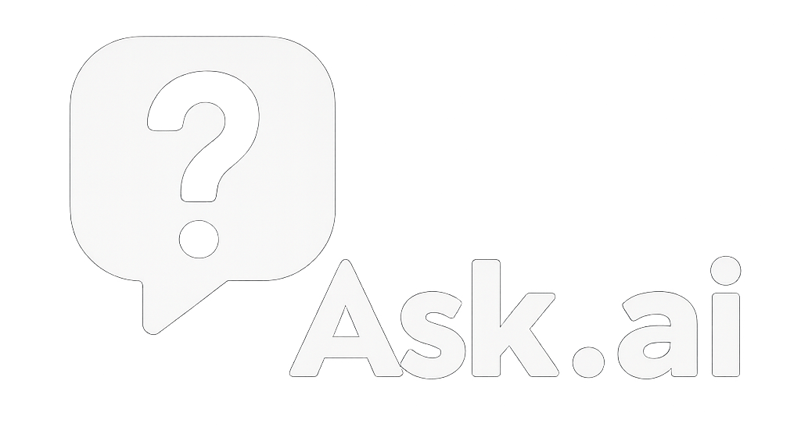

<div align="center">
  <br>
  <br>
  <span style="font-size:1.35rem; font-weight:600; color:#0d6efd; display:inline-block; margin-top:8px;">
    Ask anything, anywhere, anytime.
  </span>
  <br>
  <em style="color:#666; display:inline-block; margin-top:8px;">
    The AI assistant that's always a hotkey away—type or talk, snap a screenshot, and get instant answers. All on your desktop.
  </em>
</div>

---

## 🚀 What is ask.ai?

ask.ai is a playful, privacy-first desktop app that brings GPT-4o and Whisper voice-to-text to your fingertips. Just hit a hotkey, type or speak your question, and get answers—about anything on your screen, or anything on your mind. It's like having a genius sidekick, always ready to help.

- **Superpower:** Snap a screenshot, ask a question, and get AI-powered insights in seconds.
- **Voice Parity:** Hold the hotkey to talk, tap to type. Whisper Cloud transcribes your voice in real time.
- **Overlay Magic:** A beautiful, minimal overlay pops up anywhere, anytime.
- **Privacy by Design:** Your screenshots and audio are auto-deleted after 24h. We don't sell your data. Ever.
- **Alpha:** This is a closed alpha! Feedback is gold. [Open an issue](https://github.com/0xLoqi/ask.ai/issues) or DM @0xLoqi.

---

## ✨ Features

- 🖼️ **Screenshot Q&A:** Instantly ask about anything you see—just snap and ask.
- 🎤 **Voice or Text:** Speak or type, your choice. Whisper Cloud for fast, accurate transcription.
- ⚡ **Global Hotkey:** (Ctrl+Shift+Space or Cmd+Shift+Space) — summon the overlay from anywhere.
- 🪄 **Streaming Answers:** See responses appear as they're generated (SSE-powered).
- 🕵️ **History Viewer:** Browse, search, and clear your past questions and answers.
- 🔒 **Local-First:** Your history stays on your device. No cloud storage.
- 🛡️ **Strict Privacy:** Screenshots/audio auto-delete after 24h. No ads, no tracking.
- 🧠 **GPT-4o & Vision:** Uses OpenAI's latest models for both text and image understanding.
- 🛠️ **Built with:** TypeScript, Electron, Zod, OpenAI, Whisper, and more.

---

## 🛠️ How it Works

1. **Summon the Overlay:**
   - Tap the hotkey to type, or hold to talk. (Mic unavailable? It falls back to typing mode.)
2. **Ask Anything:**
   - Type or speak your question. Attach a screenshot for visual Q&A.
3. **Get Instant Answers:**
   - Answers stream in, powered by GPT-4o and Vision.
4. **Review & Clear History:**
   - All your Q&A stays local. Clear it anytime.

---

## 🖥️ Installation

1. **Clone the repo:**
   ```bash
   git clone https://github.com/0xLoqi/ask.ai.git
   cd ask.ai
   ```
2. **Install dependencies:**
   ```bash
   npm install
   ```
3. **Start the app:**
   ```bash
   npm start
   ```

> _Note: This is a closed alpha. You may need an invite or token to use all features._

---

## 🤖 Tech Stack
- **Electron** (desktop shell)
- **TypeScript** (strict mode)
- **OpenAI GPT-4o** (text & vision)
- **Whisper Cloud** (voice-to-text)
- **Zod** (runtime validation)
- **SSE** (streaming answers)
- **electron-store** (local storage)

---

## 📝 Project Structure
- `src/electron/` — Main Electron process
- `src/renderer/` — Overlay UI, history, and client logic
- `src/backend/` — API, SSE, and OpenAI integration
- `assets/` — App icons and logo

---

## 🔒 Privacy

**Your privacy is important. Here's how ask.ai handles your data:**

- **Screenshots & Audio:**
  - Any screenshots or audio you submit are automatically deleted from our servers after **24 hours**.
  - No screenshots or audio are retained beyond this period.

- **User Data:**
  - We do **not** sell, rent, or share your personal data with third parties.
  - Your queries and responses are stored locally for your own history and are not uploaded to any external service.

- **OpenAI Data Policy:**
  - All AI processing is performed via the OpenAI API. For details on how OpenAI handles your data, see the [OpenAI API Data Usage Policy](https://openai.com/policies/api-data-usage-policy).

- **Error Logs:**
  - Error logs are sent to a private webhook for debugging and reliability purposes. These logs may include error messages and technical details, but do **not** include your screenshots, audio, or personal information.
  - Logs are stored securely and are not shared with third parties.

- **Data Retention:**
  - Usage logs (model, token counts, latency) are stored locally for analytics and troubleshooting. No user-identifiable information is included.
  - You may clear your local history at any time via the app's history viewer.

- **Third-Party Sharing:**
  - No user data is shared with advertisers or analytics providers.
  - Data is only shared with OpenAI for the purpose of generating responses.

- **Your Rights:**
  - You may request deletion of your data at any time by contacting the author.
  - For any privacy concerns, please open an issue or contact the maintainer directly.

---

## 🧪 Alpha Status & Feedback

This is a closed alpha. Features may change, break, or disappear! Your feedback shapes the future of ask.ai.

- Found a bug? Have an idea? [Open an issue](https://github.com/0xLoqi/ask.ai/issues) or DM @0xLoqi.
- Want to contribute? PRs and suggestions are welcome!

---

## 📜 License

MIT License

---

_Made with 🤖, ☕, and a dash of magic by 0xLoqi_ 